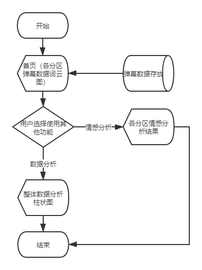
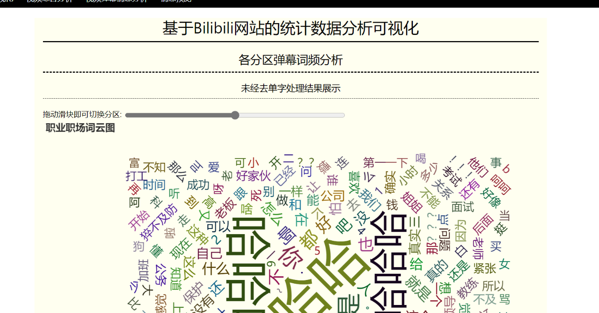
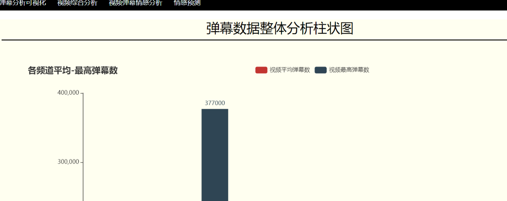
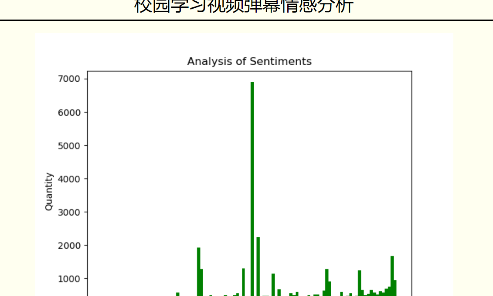

# bilibili_visualization
This is a project to visualize the crawled data of bilibili

## environment
Python版本：Python 3.7.0  
主要调用的包的版本：    
Tensorflow 1.15.0    
Flask 1.1.2  
Keras  2.3.1  
scikit_learn  0.20.4  
snownlp 0.12.3  
selenium 3.141.0  
jieba 0.42.1  
wordcloud  1.5.0  
pyecharts  1.7.1  
scrapy 2.5.0  

## project structure picture

## project diagram

